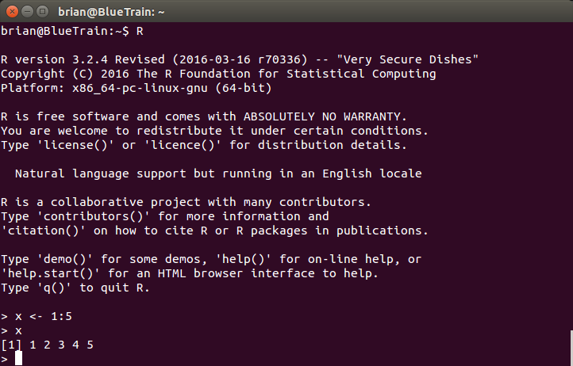

# Getting started

This chapter will give you a short tour through R. We'll assume that you've installed R and Rstudio. By the end of this chapter you will be able to:

* enter some basic commands, 
* draw some pictures,
* create your first statistical model, 
* save and reload a script, 
* understand what a package is and how to install them.

## The Operating Environment

Right. So, you've got R installed. Now what? Among the first differences you'll encounter relative to Excel is that you now have several different options when it comes to using R. R is an engine designed to process R commands. Where you store those commands and how you deal with that output is something over which you have a great deal of control. Terrible, frighening control. Here are those options in a nutshell:

* Command-line interface (CLI)
* RGui
* RStudio
* Others

### Command-line interface

R, like S before it, presumed that users would interact with the program from the command line. And, if you invoke the R command from a terminal, that's exactly what you'll get. The image below is from my 



Throughout this book, I will assume that you're using RStudio. You don't have to, but I will strongly recommend it. Why?

* Things are easier with RStudio
* RStudio, keeps track of all the variables in memory
* Everyone else is using it[^bad_reason]. 

[^bad_reason]: OK, not much of an argument. This is the exact opposite of the logic our parents used to try and discourage us from smoking. However, in this case, it makes sense. When you're talking with other people and trying to reproduce your problem or share your awesome code, they're probably using RStudio. Using the same tool reduces the amount of effort needed to communicate.

## Entering Commands

Now that you've got an environment, you're ready to go. That cursor is blinking and waiting for you to tell it what to do! So what's the first thing you'll accomplish?

In RStudio, the console may be reached by pressing CTRL-2 (Command-2 on Mac). 

Well, not much. We'll get into more fun stuff soon, but for now let's play it safe. You can use R a basic calculator, so take a few minutes to enter some basic mathematical expressions.

```{r eval=TRUE, echo=TRUE}
1 + 1

pi

2*pi*4^2
```

## Your first script

Typing, editing and debugging at the command line will get tedious quickly.

A source file (file extension .R) contains a sequence of commands.

Analogous to the formulae entered in a spreadsheet (but so much more powerful!)

```{r}
N <- 100
B0 <- 5
B1 <- 1.5

set.seed(1234)

e <- rnorm(N, mean = 0, sd = 1)
X1 <- rep(seq(1,10),10)

Y <- B0 + B1 * X1 + e

myFit <- lm(Y ~ X1)
```

Save this file.

CTRL-S on Windows/Linux, CMD-S on Mac.

### Executing a script

Either: 

1. Open the file and execute the lines one at a time, or

2. Use the "source" function.

```{r eval=FALSE}
source("SomefileName.R")
```

Within RStudio, you may also click the "Source" button in the upper right hand corner.

## Getting help

```{r eval=FALSE, echo=TRUE, size='tiny'}
?plot

??cluster
```

Within RStudio, the TAB key will autocomplete

## The working directory

The source of much frustration when starting out.

Where am I?

```{r eval=TRUE, echo=TRUE, size='tiny'}
getwd()
```

How do I get somewhere else?

```{r eval=FALSE, results='hide', size='tiny'}
setwd("~/SomeNewDirectory/SomeSubfolder")
```

Try to stick with relative pathnames. This makes work portable.

### Directory paths

R prefers Unix style directories[^mac_also_unix]. This means "/", __not__ "\\". Windows prefers "\\". All things being equal, this isn't much of a big deal; it's just an arbitrary convention, like deciding that electricity flows from negative to positive rather than the other way around[^ben_franklin_electricity]. R is designed to be deployed on both Windows and Unix, so its internal functions will use whatever convention applies on the target operating system. However, there's a catch: "\\" is an "escape" character, used for things like tabs and newline characters. To get a single slash, you need to type it twice.

[^mac_also_unix]: The Mac OS was based on Unix and adopts many of its conventions, among them file path separators.
[^ben_franklin_electricity]: Benjamin Franklin reference here.

