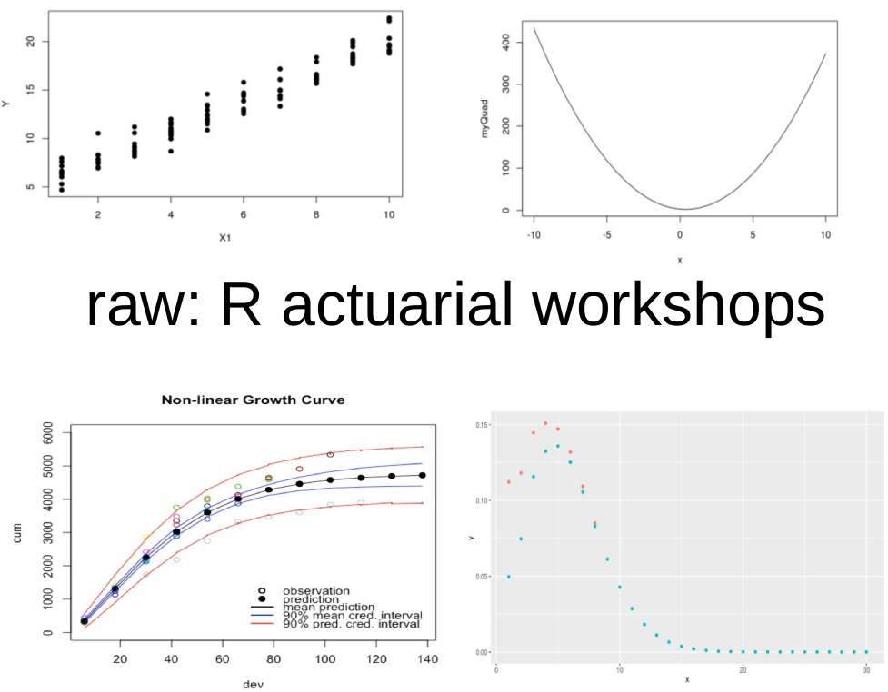

--- 
title: "raw - R Actuarial Workshops"
author: "Brian A. Fannin, ACAS"
date: "`r Sys.Date()`"
site: bookdown::bookdown_site
documentclass: book
bibliography: [packages.bib, references.bib]
biblio-style: alpha
link-citations: true
github-repo: PirateGrunt/raw_book
description: "This is a companion to actuarial workshops."
knit: "bookdown::render_book"
cover-image: raw_cover.png
---

# Introduction {-}

Hello! Very happy to have you here and I hope you find this useful. This book is meant to serve as a companion to any of the R training sessions that I'm involved in. A few quick notes before we proceed.

#### Why does this book exist? {-}

For over three years now, I've joined other actuaries in teaching R at events sponsored by the Casualty Actuarial Society[^CAS_CYA]. I've learned a lot about what questions get asked, where folks get stuck and what content matters most. We've reached the place where, to be honest, attendees can get more out of the live sessions if they come in having done some preliminary work. That should give us more opportunity for hands on instruction. At a minimum, this book should serve as a handy reference before, during and after a live training to reinforce what we're trying to teach.

That understood, this book is hardly the only game in town. There are loads of good books about R and I can easily recommend many of them. [@Matloff] is a great one. Go check them out. I have.

#### This is an organic book {-}

You'll not find this in Barnes & Nobel or Amazon and I'll strongly suggest that you resist the temptation to print this. I fully expect that there will corrections, additions and updates as the technology changes. The book will live on the internet as long as I can support it and it's probably best to check it out there. By all means, download the PDF if you'd like a local copy, but do check back for updates.

#### You don't need to read this from start to finish {-}

Though I've done my best to give this book a clear flow, I've had to make a few sacrifices in order to get in all the material that I needed. This means that there are some, sorry, boring bits like a page about data types or how to write loops and such. Some people will find this stuff fascinating, some people will find this ... necessary. Feel free to treat this like a reference text and not like a Michael Chabon novel and you're likely to get more out of it.

So, that's all the preliminaries. Away we go!

[^CAS_CYA]: The CAS has not sponsored this publication and no one should construe my involvement with the CAS as constituting their endorsement of the material presented here.